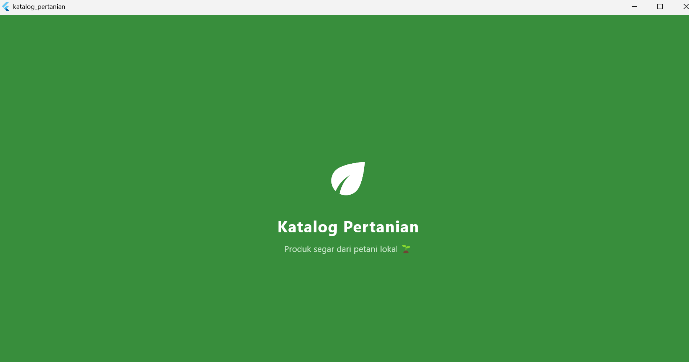
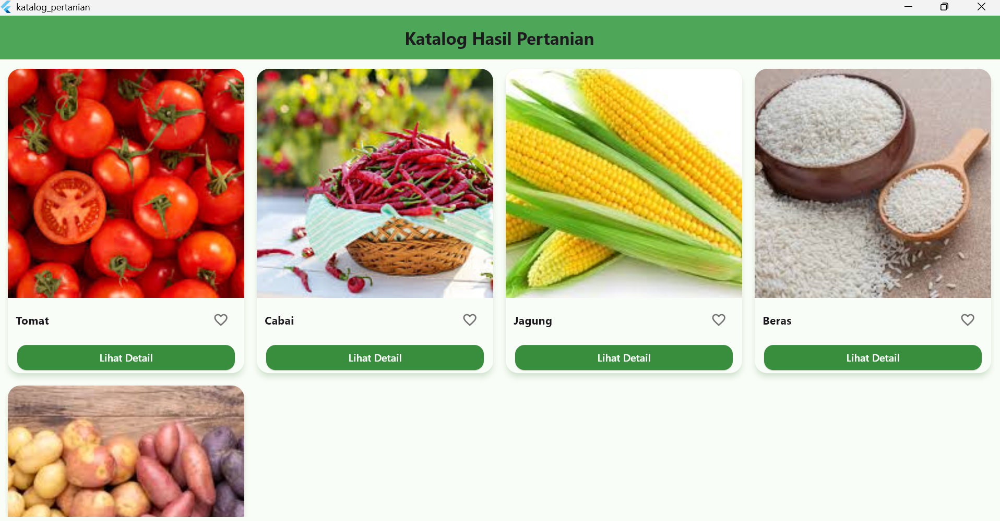
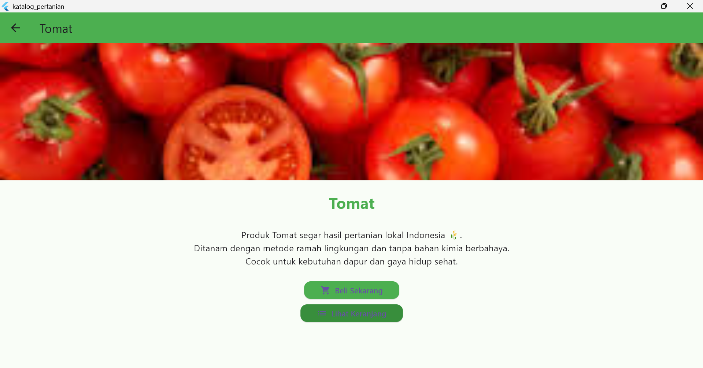
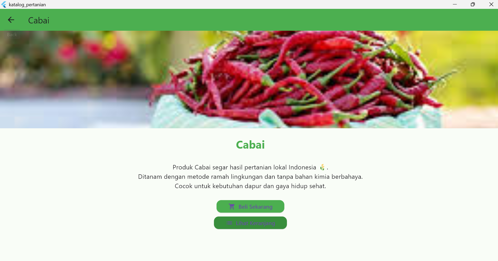
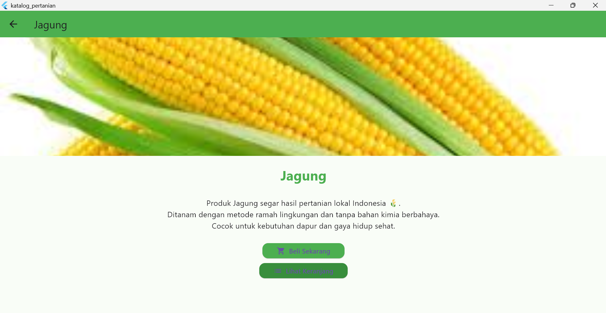
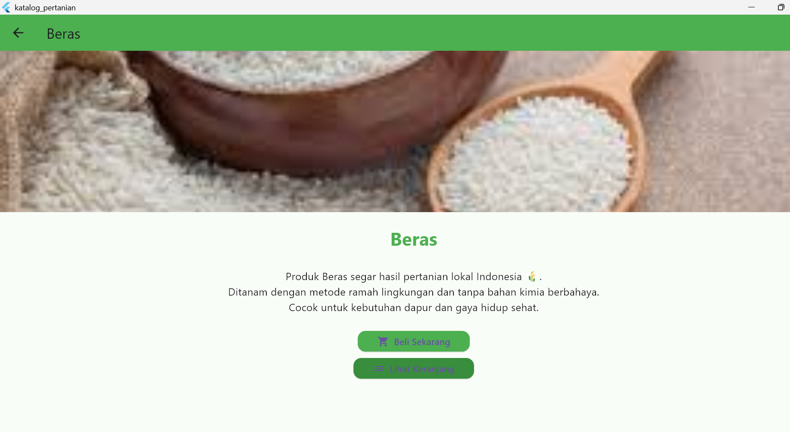
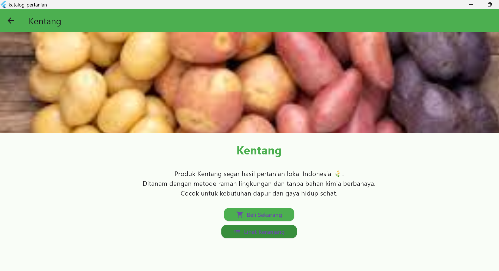

# 📱 UTS Mobile Programming 2
## Judul Aplikasi: **Katalog Hasil Pertanian** 🌾

### 👩‍🎓 Identitas Mahasiswa
- **Nama:** Caca Cahyadi  
- **NIM:** 232101058  
- **Kelas:** TIF RP 23G  
- **Mata Kuliah:** Pemrograman Mobile 2  
- **Dosen Pengampu:** Niken Riyanti, ST.

---

### 📖 Deskripsi Aplikasi
Aplikasi **Katalog Hasil Pertanian** merupakan aplikasi katalog sederhana yang menampilkan beberapa hasil pertanian lokal Indonesia. Aplikasi ini dibuat menggunakan **Flutter** dengan fitur:

- Menampilkan daftar produk hasil pertanian menggunakan **GridView**  
- **Custom Widget** (`ProductCard`) untuk tiap item  
- Animasi transisi dengan **Hero** & **AnimatedScale**  
- **StatefulWidget** untuk fitur **Favorite**  
- **Splash Screen** saat pertama kali aplikasi dijalankan  

---

### 📂 Link Google Drive (Laporan + Video Demo)
[Laporan + Video Demo](https://drive.google.com/drive/folders/1oWxVn_z3TJhanIcaDX726o7y75oAdgmM?usp=sharing)

---

### 🧩 Struktur Proyek
lib/
├── main.dart  
├── splash_screen.dart  
├── home_page.dart  
├── product_card.dart  
└── detail_page.dart  

pubspec.yaml → konfigurasi dependencies & assets  
assets/images/ → gambar hasil pertanian  
assets/screenshots/ → screenshot tampilan aplikasi

---

### 🖼️ Tampilan Aplikasi

#### 1. Splash Screen

#### 2. Halaman Beranda

#### 3. Detail Produk

| Tomat | Cabai | Jagung |
|------|------|--------|
|  |  |  |

| Beras | Kentang |
|------|---------|
|  |  |

---

### ✅ Status
- ✅ Aplikasi dapat dijalankan dengan baik  
- ✅ Implementasi widget wajib telah terpenuhi (GridView, Custom Widget, Animasi)  
- ✅ Laporan & Video telah di-upload pada Google Drive  
- ✅ README telah diperbarui sesuai instruksi tugas  

---

© 2025 - Caca Cahyadi | Teknik Informatika | Universitas Teknologi Bandung
